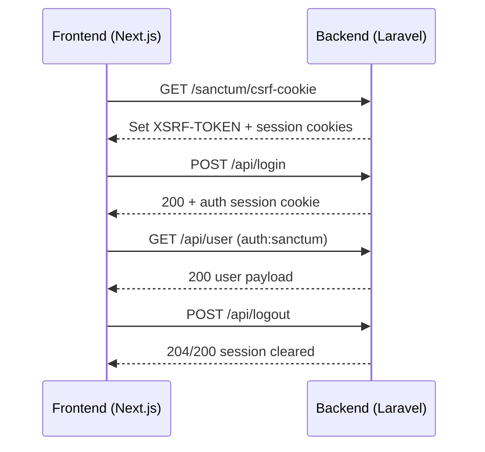

# SmartCardBackend — Technical Documentation (Backend)

## Overview

This backend is a **Laravel 8** application (PHP ^7.3|^8.0) that provides:

- **SPA authentication** for a Next.js frontend using **Laravel Sanctum** (stateful cookie auth + CSRF).
- A set of **REST APIs** under `routes/api.php` for QR generation, SmartCard, subscriptions/payments, resumes, appointments/scheduling, website/instagram cards, FAQs, messages, and a modular **Health Card** system.
- An **admin panel** under `/admin/*` (web routes) protected by `auth` + `admin` middleware.

Key entrypoints:

- **HTTP kernel / app bootstrap**: standard Laravel (`public/index.php`, `artisan`, `bootstrap/`)
- **Routes**: `routes/api.php`, `routes/web.php`, `routes/auth.php`

## Visual Diagrams (Mermaid)

> If your Markdown viewer supports Mermaid, these render as diagrams. These are also great for PDF export.

### System overview

```mermaid
flowchart LR
  FE[Next.js Frontend\n(port 3001)] -->|Axios (cookies + CSRF)\nNEXT_PUBLIC_BACKEND_URL| BE[Laravel 8 Backend\n(port 8000)]
  BE --> DB[(MySQL Database)]
  BE --> Stripe[(Stripe)]
  BE --> PayPal[(PayPal)]
  BE --> AamarPay[(Aamarpay)]
  BE --> Mail[(SMTP / Mail)]
  BE --> GCal[(Google Calendar)]
```

### Auth (Sanctum SPA cookie) sequence



### API modules (high-level map)

```mermaid
flowchart LR
  API((API /api))

  subgraph AUTH[Auth (Sanctum)]
    A1[POST /register]
    A2[POST /login]
    A3[GET /user]
    A4[POST /logout]
    A5[POST /password/email]
    A6[POST /password/reset]
    A7[POST /email/verification-notification]
  end

  subgraph QR[QR Generator]
    Q1[POST /qrcreate]
    Q2[GET /information/:slug]
    Q3[GET /getqr/:user]
    Q4[PUT /qrgen/toggle-status/:id]
  end

  subgraph PKG[Country & Packages]
    P1[GET /country]
    P2[GET /packages/filter]
    P3[GET /packages/:id]
  end

  subgraph PAY[Payments]
    Y1[Aamarpay\nPOST /make-payment\nPOST /verify-payment]
    Y2[Stripe\nPOST /create-payment-intent]
    Y3[PayPal\nPOST /paypal/create-payment\nPOST /paypal/capture-order]
  end

  subgraph RES[Resume]
    R1[GET /user/:user/resumes]
    R2[GET /resume/:slug]
    R3[POST /resume]
  end

  subgraph APPT[Appointment & Schedule]
    S1[Schedules CRUD]
    S2[Appointments CRUD]
    S3[GET /get-available-slots/:user_id/:date]
  end

  subgraph SC[SmartCard]
    C1[GET /get-card-design]
    C2[GET /card-details/:id]
    C3[POST /smartcard/create-payment-intent]
    C4[POST /make-order]
  end

  subgraph HC[HealthCards (Module)]
    H1[CRUD /healthcards]
    H2[Medical reports]
    H3[Public access\n/healthcards/qr/:hash\n/healthcards/public/:slug]
  end

  API --> AUTH
  API --> QR
  API --> PKG
  API --> PAY
  API --> RES
  API --> APPT
  API --> SC
  API --> HC

  classDef box fill:#111827,stroke:#6b7280,color:#e5e7eb,stroke-width:1px;
  class API,AUTH,QR,PKG,PAY,RES,APPT,SC,HC box;
```

## Tech Stack

- **Framework**: Laravel `^8.75` (`composer.json`)
- **Auth**: Laravel Sanctum (`config/sanctum.php`, `config/auth.php`)
- **DB**: MySQL by default (`config/database.php`, `.env`)
- **Payments**:
    - Stripe (`stripe/stripe-php`)
    - PayPal (`paypal/paypal-checkout-sdk`)
- **PDF / export**: `barryvdh/laravel-dompdf`, `mpdf/mpdf`, `barryvdh/laravel-snappy`
- **Google**: `google/apiclient`, `spatie/laravel-google-calendar`
- **Images**: `intervention/image`
- **Logging viewer**: `opcodesio/log-viewer`

## Repository Structure (high-level)

- `app/Http/Controllers/`: Controllers (API + Admin + Auth)
- `app/Modules/HealthCard/`: Modular Health Card feature (separate provider/routes/controllers/models)
- `app/Services/`: Domain services (e.g. subscription payload, invoice, OCR, visitors)
- `config/`: Laravel config (auth, cors, sanctum, mail, queue, logging, services, etc.)
- `database/migrations/`: Schema migrations
- `resources/`: Blade views, assets
- `public/`: Public web root
- `routes/`: Web + API routes
- `storage/`: Logs, cache, compiled views, uploads (depending on filesystem config)

## Environment & Configuration

Example env file: `.env.example`

### Required (typical) env keys

- **App**
    - `APP_ENV`, `APP_KEY`, `APP_URL`, `APP_DEBUG`
- **Database**
    - `DB_CONNECTION=mysql`
    - `DB_HOST`, `DB_PORT`, `DB_DATABASE`, `DB_USERNAME`, `DB_PASSWORD`
- **Sanctum / SPA**
    - `FRONTEND_URL` (used by CORS + Sanctum stateful config)
    - `SANCTUM_STATEFUL_DOMAINS` (optional; Sanctum has defaults but production should be explicit)
- **Payments**
    - `STRIPE_SECRET`, `STRIPE_PUBLIC`
    - `PAYPAL_CLIENT_ID`, `PAYPAL_CLIENT_SECRET`, `PAYPAL_MODE`
- **Mail** (for password reset / verification)
    - `MAIL_MAILER`, `MAIL_HOST`, `MAIL_PORT`, `MAIL_USERNAME`, `MAIL_PASSWORD`, `MAIL_FROM_ADDRESS`

### CORS behavior

Configured in `config/cors.php`:

- `supports_credentials` is **true** (required for cookie-based auth).
- `allowed_origins` is derived from `FRONTEND_URL` (comma-separated).

### Sanctum behavior

Configured in `config/sanctum.php`:

- `stateful` domains include localhost defaults + `APP_URL` host + `FRONTEND_URL` host.
- Uses standard CSRF + cookie encryption middleware.

## Local Development Setup

### Prerequisites

- PHP (compatible with `composer.json`)
- Composer
- MySQL (or compatible DB)

### Install

1. Install dependencies:
    - `composer install`
2. Create env:
    - copy `.env.example` → `.env`
3. App key:
    - `php artisan key:generate`
4. Migrate DB:
    - `php artisan migrate`
5. Run server:
    - `php artisan serve` (default `http://localhost:8000`)

## Authentication Model (Next.js SPA)

This project uses **Sanctum SPA cookie auth** (not pure bearer-token auth).

### Typical frontend flow

1. `GET /sanctum/csrf-cookie`
2. `POST /api/login` (sets session/auth cookies)
3. `GET /api/user` (returns authenticated user + subscription payload)
4. `POST /api/logout`

Relevant routes (see `routes/api.php`):

- `POST /api/register`
- `POST /api/login`
- `POST /api/password/email`
- `POST /api/password/reset`
- `POST /api/email/verification-notification-public`
- `GET  /api/user` (auth required)
- `POST /api/logout` (auth required)
- `POST /api/email/verification-notification` (auth required)

## API Surface (Route Map)

Primary API file: `routes/api.php`

### QR Generator

- `POST /api/qrcreate`
- `GET  /api/information/{slug}`
- `GET  /api/getqr/{user}`
- `POST /api/updateqr/{id}`
- `GET  /api/editqr/{id}`
- `DELETE /api/deleteqr/{id}`
- `PUT /api/qrgen/toggle-status/{id}`
- `GET /api/getActiveQr/{userId}`
- `GET /api/getpauseQr/{userId}`
- `GET /api/qr-details/{id}`

### Country & Packages

- `GET /api/country`
- `GET /api/packages/filter`
- `GET /api/packages/{id}`

### Payments / Subscriptions

- `POST /api/make-payment`
- `POST /api/verify-payment`
- `POST /api/create-payment-intent` (Stripe subscription flow)
- `POST /api/save-transaction`
- `POST /api/paypal/create-payment`
- `POST /api/paypal/capture-order`
- `GET  /api/paypal/payment/{paymentId}`
- `POST /api/check-subscription`

### Instagram / Website cards

- `POST /api/create-instagram`
- `GET  /api/get-instagram/{user}`
- `POST /api/update-instagram/{id}`
- `DELETE /api/delete_instagram/{id}`
- `GET  /api/edit_instagram/{id}`

- `POST /api/create-website`
- `GET  /api/get-website/{user}`
- `POST /api/update_website/{id}`
- `GET  /api/edit_website/{id}`
- `DELETE /api/delete_website/{id}`

### Templates

- `GET /api/template-category`
- `GET /api/templates/{id}`
- `GET /api/template/{id}`

### Resume Builder

- `GET  /api/user/{user}/resumes`
- `GET  /api/resume/{slug}`
- `POST /api/resume`
- `GET  /api/resume/edit/{slug}`
- `POST /api/resume/{resume}`
- `DELETE /api/resume/{resume}`

### Scheduling & Appointments

- `POST   /api/schedules`
- `GET    /api/schedules/{id}`
- `PUT    /api/schedules/{id}`
- `DELETE /api/schedules/{id}`
- `GET    /api/schedule/{id}`
- `GET    /api/get-available-slots/{user_id}/{date}`

- `POST   /api/create-appointment`
- `GET    /api/all-appointment/{id}`
- `GET    /api/appointment/show/{id}`
- `POST   /api/appointment/approved/{id}`
- `POST   /api/appointment/decline/{id}`
- `DELETE /api/appointment/{id}`

### Contact / FAQ

- `POST /api/message`
- `GET  /api/faqs`

### Smart Card (design + orders)

- `GET  /api/get-card-design`
- `GET  /api/card-details/{id}`
- `POST /api/smartcard/create-payment-intent`
- `POST /api/create-checkout-session`
- `POST /api/make-order`
- `GET  /api/cards`

### Health Card module

Implemented under `app/Modules/HealthCard` and wired in `routes/api.php`.

- Auth required (prefix `/api/healthcards`):
    - `GET /api/healthcards`
    - `POST /api/healthcards`
    - `GET /api/healthcards/{id}`
    - `PUT /api/healthcards/{id}`
    - `DELETE /api/healthcards/{id}`
    - `GET /api/healthcards/{healthCardId}/medical-reports`
    - `POST /api/healthcards/{healthCardId}/medical-reports`
    - `GET /api/healthcards/medical-reports/{id}`
    - `PUT|POST /api/healthcards/medical-reports/{id}`
    - `DELETE /api/healthcards/medical-reports/{id}`
- Public:
    - `GET /api/healthcards/qr/{hash}`
    - `GET /api/healthcards/public/{slug}`

Reference: `app/Modules/HealthCard/README.md`

## Admin Panel (Web)

Admin routes are defined in `routes/web.php` under:

- Prefix: `/admin`
- Middleware: `auth`, `admin`
- Resources: users, cards, packages, payments, subscriptions, website/instagram, templates, products/colors, messages, resumes, FAQ, smart-card, visitors, profile, card-order.

### Admin authorization (roles)

Admin access is enforced by custom middleware:

- `app/Http/Middleware/AdminMiddleware.php`

The middleware checks role(s) before allowing access to the `/admin/*` route group.

## Database

Migrations: `database/migrations/*.php`

Major tables inferred from migrations:

- `users` (+ role)
- QR: `qrgens`
- `countries`, `packages`, `payments`, `subscriptions`, `orders`
- Resume: `resumes`, templates/categories
- Scheduling: `schedules`, `appointments`, `schedule_areas`
- Smart card: `smart_cards`, `card_orders`
- CMS: `messages`, `f_a_q_sections`, `f_a_q_questions`
- Health cards: `health_cards`, `health_card_medical_reports`

## Background Jobs / Queue

Queue config: `config/queue.php`

- Default in `.env.example`: `QUEUE_CONNECTION=sync`
- If you switch to async queues (database/redis), ensure worker is running:
    - `php artisan queue:work`

### Scheduler / Cron

This project uses Laravel Scheduler for periodic tasks:

- Scheduler config: `app/Console/Kernel.php`
- Example scheduled command:
    - Command registration / schedule: `app/Console/Kernel.php`
    - Command implementation: `app/Console/Commands/UpdateQRGenStatus.php`

Production cron (typical):

- Run every minute: `php artisan schedule:run`

## Logging & Troubleshooting

- Logging config: `config/logging.php`
- Typical runtime logs: `storage/logs/laravel.log`
- Log viewer package installed: `opcodesio/log-viewer` (check vendor docs / any route exposure in app)

Common issues:

- **419 (CSRF mismatch)**: Sanctum cookie/CSRF flow not followed or domains mismatch.
- **CORS blocked**: ensure `FRONTEND_URL` contains the exact origin(s) and `supports_credentials=true`.
- **Auth not persisting**: check `SANCTUM_STATEFUL_DOMAINS`, cookie domain, HTTPS/Secure cookies in production.

## Notable Integrations & External Services

### Payments

- **Stripe**: `config/services.php` and Stripe controllers/routes (see `routes/api.php`)
- **PayPal**: `config/paypal.php` and PayPal controllers/routes (see `routes/api.php`)
- **Aamarpay**: implemented in `app/Http/Controllers/Api/PaymentController.php` (make/verify + success/fail/cancel endpoints in `routes/api.php`)

### Google Calendar

- Config: `config/google-calendar.php`
- Library: `spatie/laravel-google-calendar` (see `composer.json`)

## Tests

PHPUnit config exists at `phpunit.xml`.
If tests are added/maintained, keep them under the standard Laravel folders:

- `tests/Feature`
- `tests/Unit`

## Deployment Notes (Production)

Minimum checklist:

- Set `APP_ENV=production`, `APP_DEBUG=false`
- Set correct `APP_URL` and `FRONTEND_URL`
- Configure web server to point to `public/`
- Run:
    - `composer install --no-dev --optimize-autoloader`
    - `php artisan key:generate` (only first time)
    - `php artisan migrate --force`
    - `php artisan config:cache && php artisan route:cache && php artisan view:cache`

## Where to Extend / Add Features

- **New API endpoints**: add in `routes/api.php` and create controller in `app/Http/Controllers/Api`
- **New admin screens**: add resource controller under `app/Http/Controllers/Admin` + `routes/web.php`
- **Cross-cutting domain logic**: prefer `app/Services/*`
- **New “module-style” feature**: follow `app/Modules/HealthCard` pattern (provider + isolated namespace + migrations/tests)
